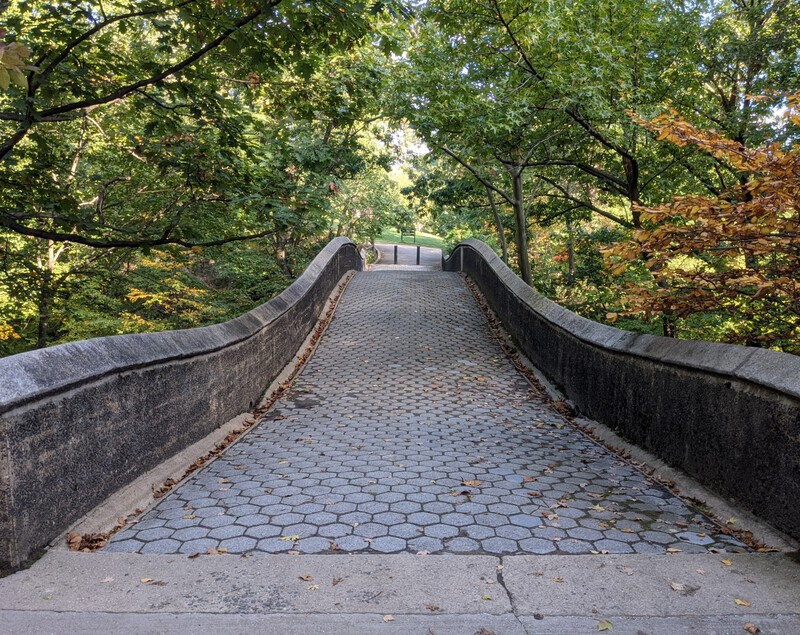
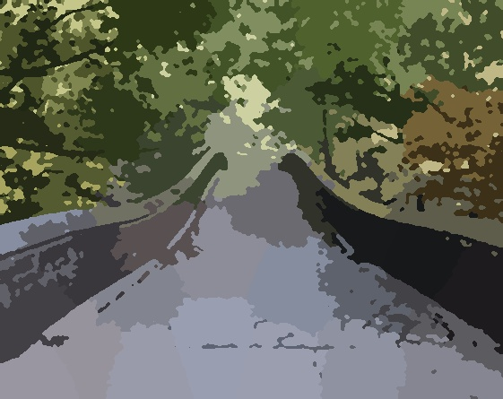
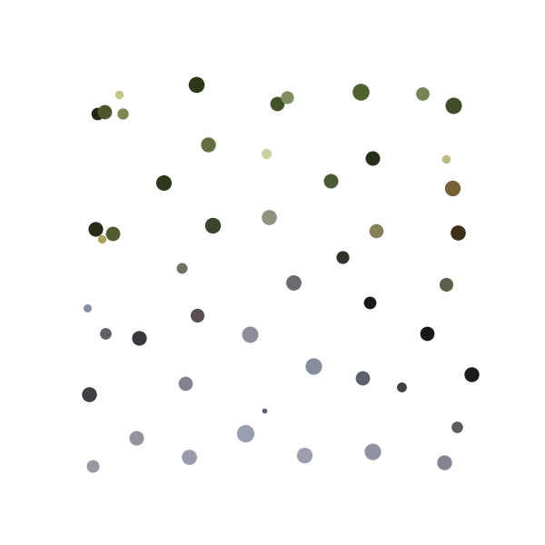

# Clustering Image Pixels

`main.py` clusters pixels in an image based on both their colors and positions,
chooses a uniform color for each cluster, and then smooths the result out.

Example:
`python main.py example_source.jpg --dest_filename example_dest.jpg`

It also outputs a "color palette" showing the position, color, and size of each centroid:

